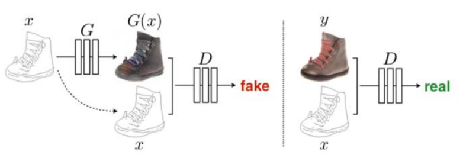
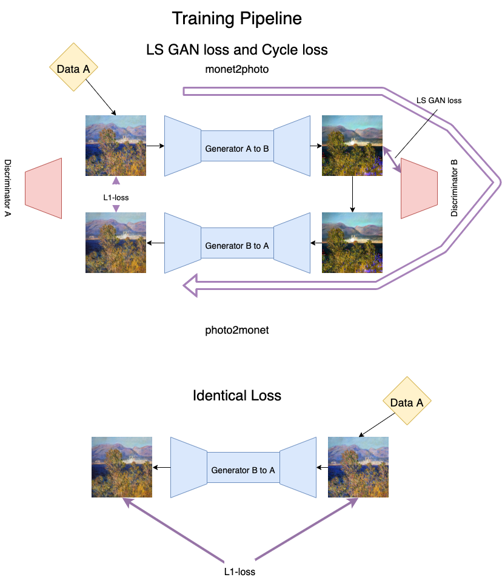
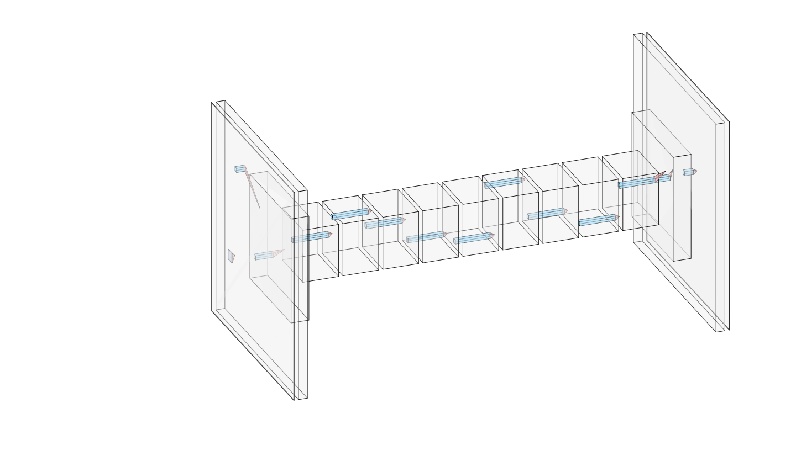
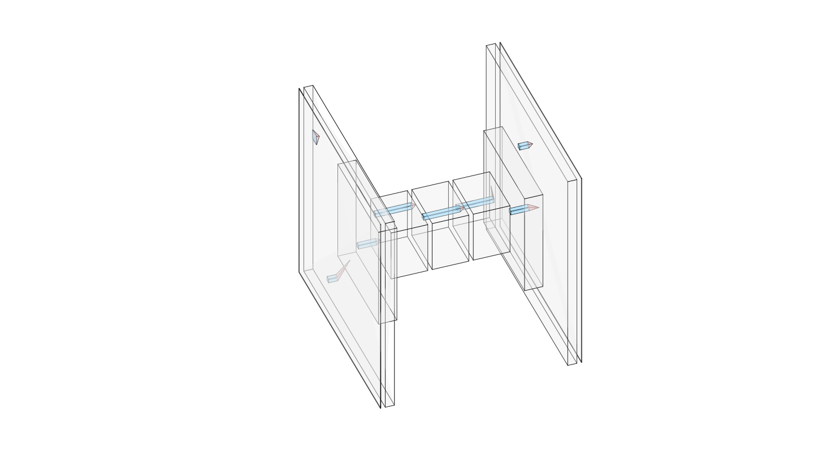
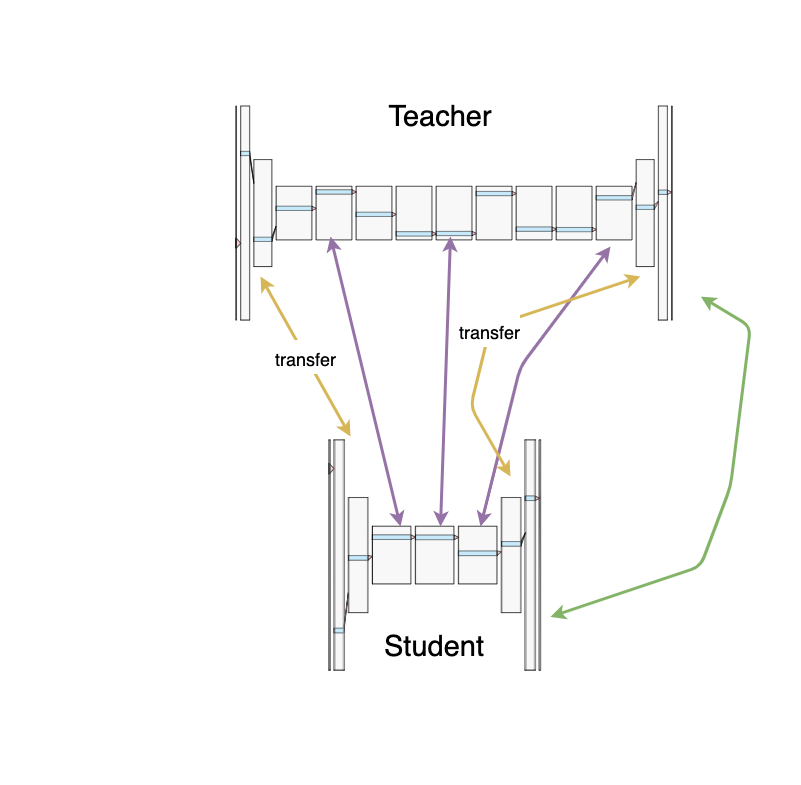
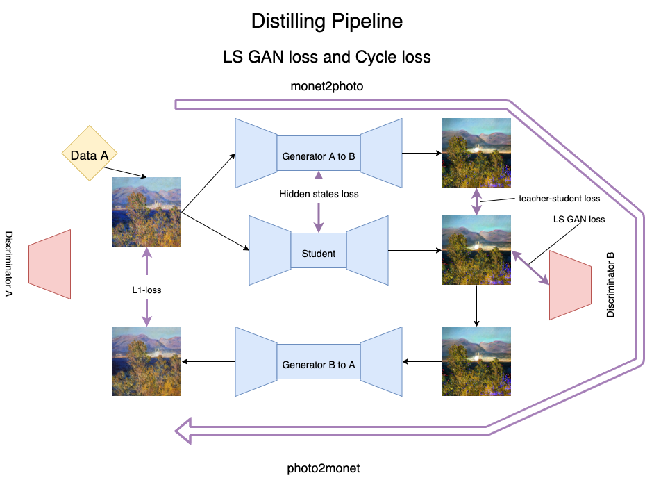

# Cycle GAN Distillation

### tl;dr

You can start teacher training with

```text
git clone https://github.com/elephantmipt/cycle-gan-distillation.git
bash bin/download_dataset.sh monet2photo
pip install -r requierements/requirements.txt
python scripts/preprocess_dataset.py --path ./datasets/monet2photo
python train.py
```

After training you can start distillation with

```text
python distil.py
```

Read these sections for more info:






### What is Cycle GAN?

Let's start with defining general task, that GAN should be able to solve. Imagine we have a data from space A and we have a data from space B. We need to learn mapping from space A to space B. For example in vanilla GAN we the data in the A space is a gaussian noise and data from B space is a handwritten digits \(MNIST\). So after training we can generate digits out of gaussian noise. First proposed method is minimizing Janson-Shanon divergence between generated data and real data in space B. But in the LSGAN paper it was shown that minimizing Chi-2 divergence works slightly better.

What about case when we have a mapping between photos from different space, so now space A is not a gaussian noise, it is a photo too?



As shown in a picture above, we have a shapes of object and we need generator to reproduce the original photo. Here we need an additional loss function to ensure that network reproduce exactly same object that was in input. For example if in input was shapes of shoes then we don't want to reproduce a colorized bag, no meter if it is realistic or not. So we can add L1-loss between generated and real colorized photo.

But what if we don't have a paired objects in our dataset? For example we have a horse and a zebra photos. Of course we can't take a photo of horse in exactly the same position and  a background as it was in a zebra photo. Here comes the Cycle GAN. Instead of L1-loss between generated and real images we can train two generators and discriminators. The first will map space A to space B, and the second will map space B to space A. So here is an example.


Iteration starts with feeding a generator, that maps B space to A, with an image of zebra. It tries to produce horse image. After that we feed generated photo to generator A-B, which tries to generate original image \(as it was a zebra\). And here we can count our reconstruction loss, which is basically L1-loss. After that we can back propagate through two discriminators.

But, unfortunately, this pipeline can produce artifacts like color inversion or pink sky. So we can add additional loss called identical loss. So we need our generators to produce exactly the same image if input image was already from target space. So the final loss is:

$$
L_{\text{generator}} = \lambda_1 L_{\text{gan}} + \lambda_2 L_{\text{cycle}} + \lambda_3L_{\text{identical}}
$$



### Proposed distillation method

Full generator has about 6 million parameters.



Proposed student generator has 3 res-blocks instead of 9, it reduces the number of parameters by a half!



I transfer downsampling and upsampling layers from teacher network \(yellow arrows\). Also I add L2-loss between hidden states of the student and teacher network \(purple arrows\) and L1-loss between output of teacher and student.



So the full pipeline looks like:



