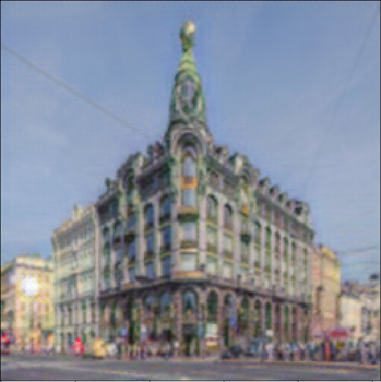
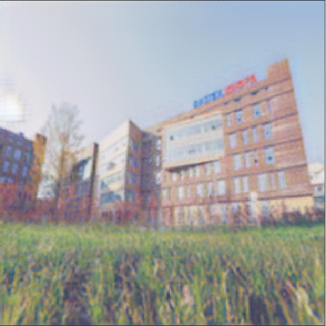
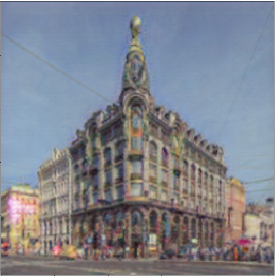
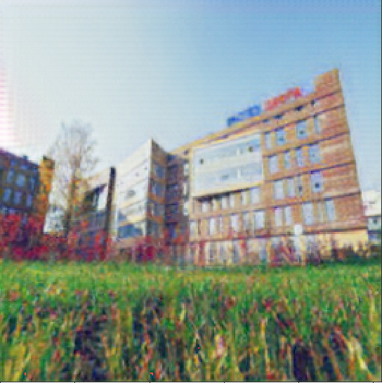
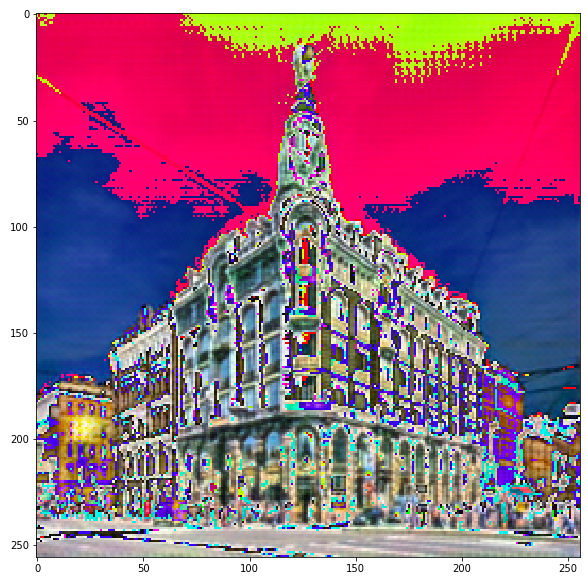
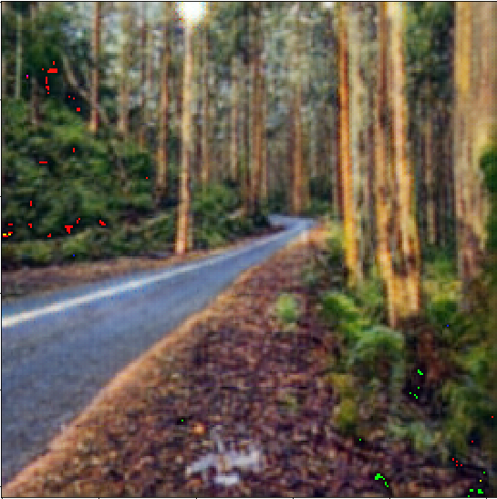

# Results

### Training teacher

The first task was implementing Cycle GAN. I used catalyst and callbacks to separate generator and discriminator training phases. So the API for training looks like this:

```python
from itertools import chain

import torch

from catalyst import dl

from src.callbacks.gan import (
    CycleGANLoss,
    GANLoss,
    IdenticalGANLoss,
    PrepareGeneratorPhase,
    GeneratorOptimizerCallback,
    PrepareDiscriminatorPhase,
    DiscriminatorLoss,
    DiscriminatorOptimizerCallback
)
from src.callbacks.visualization import LogImageCallback
from src.dataset import UnpairedDataset
from src.modules.generator import Generator
from src.modules.discriminator import NLayerDiscriminator, PixelDiscriminator
from src.runner import CycleGANRunner
from src.modules.loss import LSGanLoss

from torchvision import transforms as T
from PIL import Image

# defining dataset

train_ds = UnpairedDataset(
    "./datasets/monet2photo/trainA_preprocessed",
    "./datasets/monet2photo/trainB_preprocessed",
    transforms=T.Compose([
        T.Resize((300,300)),
        T.RandomCrop((256, 256)),
        T.RandomHorizontalFlip(),
        T.ToTensor(),
        
    ])
    
)
train_dl = torch.utils.data.DataLoader(
    train_ds,
    batch_size=1,
    shuffle=True
)

tr = transforms=T.Compose([
    T.Resize((256,256)),
    T.ToTensor(),
])

# loading images for validation
mipt_photo = tr(Image.open("./datasets/mipt.jpg"))
zinger_photo = tr(Image.open("./datasets/vk.jpg"))
# defining model arch
model = {
    "generator_ab": Generator(
         inp_channel_dim=3, 
         out_channel_dim=3,
         n_blocks=9
     ),
    "generator_ba": Generator(
         inp_channel_dim=3, 
         out_channel_dim=3,
         n_blocks=9
     ),
    "discriminator_a": PixelDiscriminator(input_channels_dim=3),
    "discriminator_b": PixelDiscriminator(input_channels_dim=3),
}

# initializing optimizers

optimizer = {
    "generator": torch.optim.Adam(
        chain(
            model["generator_ab"].parameters(),
            model["generator_ba"].parameters()
        ),
        lr=0.0002
    ),
    "discriminator": torch.optim.Adam(
        chain(
            model["discriminator_a"].parameters(),
            model["discriminator_b"].parameters()
        ),
        lr=0.0002
    )
}
callbacks = [
    ##############################################
    PrepareGeneratorPhase(),
    GANLoss(),
    CycleGANLoss(),
    IdenticalGANLoss(),
    GeneratorOptimizerCallback(
        weights=[1, 10, 5],  # weights for losses
    ),
    ##############################################
    PrepareDiscriminatorPhase(),
    DiscriminatorLoss(),
    DiscriminatorOptimizerCallback(),
    ##############################################
    LogImageCallback(),  # valid images
    LogImageCallback(key="mipt", img=mipt_photo),
    LogImageCallback(key="vk", img=zinger_photo),
]

# criterions for losses

criterion = {
    "gan": LSGanLoss(),
    "cycle": torch.nn.L1Loss(),
    "identical": torch.nn.L1Loss(),
}

runner = CycleGANRunner(buffer_size=50)

runner.train(
    model=model,
    optimizer=optimizer,
    loaders={"train": train_dl},
    callbacks=callbacks,
    criterion=criterion,
    num_epochs=100,
    verbose=True,
    logdir="naive_train",
    main_metric="identical_loss"
)
```

I trained for about 60 hours \(62k iterations\) to get relatively good results, here is an output images example:

I will tell you more about an artifacts latter.

### Distillation

I tried to use scheme proposed in the previous section. I mentioned that student converges extremely fast \(about three ours and 30k iterations\) to results same as a teacher.

|  |  |
| :--- | :--- |
|    |  |

### Results reliableness

After this experiment I thought that this is it, but after checking if my results useful I also trained the student network without layer transfer and initialize other parts of network with random weights. The convergence were slightly worse in comparasion to teacher training process. It takes about two days to reach  But the images were pretty well but with slightly more artifacts.

|  |  |
| :--- | :--- |
|   |   |

### Using pre-trained network

I spend about day to somehow improve teacher quality. I find that in official CycleGAN [repo](https://github.com/junyanz/pytorch-CycleGAN-and-pix2pix) there is some pre-trained weights for my dataset. I succesefuly tried to match state dict of my model and pre-trained. But get corious results. So after feeding images to network I got this:

|  |  |
| :--- | :--- |
|    |   |

Interesting that it is a kinda similar to[ layer visualizations](https://distill.pub/2017/feature-visualization/) in convolution networks.  
I tried to tune it, but even with big weight for identical loss I failed to remove this color inversions.

### Artifacts

I faced with two types of artifact the first is red or green points on the dark parts of images:



And chessboard artifact on the sky:


And if the first artifact is not a problem at all. I just need to train my network for more epochs, the chessboard artifact is annoying and I can't handle it with increasing number of iterations. So I found post [here](https://distill.pub/2016/deconv-checkerboard/) which explains problem and suggests to use upsample with convolution. Now I'm trying to train teacher with this trick.

